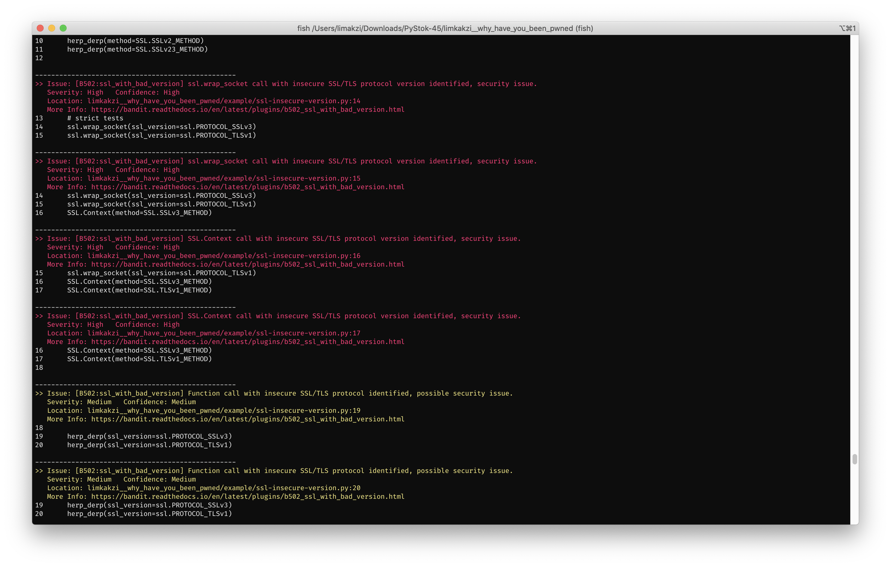

## PyStok45

<p align="center" float="left">
  
</p>

- Zainstaluj `pre-commit` [zgodnie z dokumentacją dla swojego systemu operacyjnego.](https://pre-commit.com/).

- Umieść plik `.pre-commit-config.yaml` w katalogu głównym repozytorium.

- Wykonaj komendę instalującą `hook`-i `pre-commit`:

```
pre-commit install
```

- Uruchom `pre-commit` względem wszystkich plików testowych:

```
pre-commit run --all-files
```
